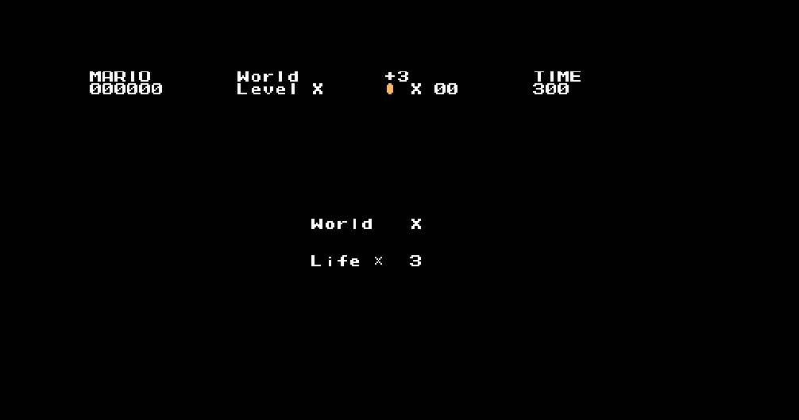

## Super-mario Implementation in Javascript
*This is inspired by Meth-Meth-Methods's [super mario game](https://github.com/meth-meth-method/super-mario)*

### Running
* clone this repo
* npm init
* npm start
* go to local host

### Play this game using chrome 
[Play this game here](https://xinyu-supermario-js.herokuapp.com/)

### Controls 
* Left: Move left
* Right: Move right
* Space: Jump
* Shift: Boost

### In-game Screens

#### Start

#### Inside Game

#### Ending

### Distinctive contributions 
1. Fixed bugs on Mario's speed and acceleration.
2. Added new characters to the game:  Spiny and Lahitu.
3. Added Hoopa which is able to fly and then switch to to "walk mode" after hit by Mario.
4. Add question blocks which release mushrooms after being hit by Mario.
5. Mario becomes Super mario after eating mushroom.

